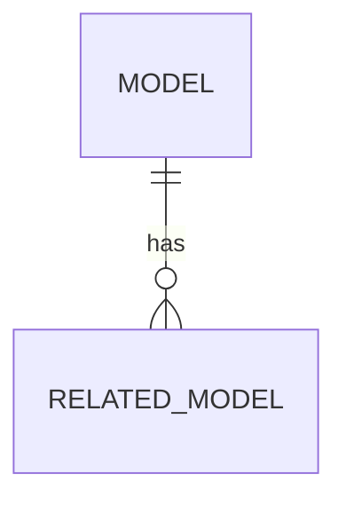

# 🏗️ PLAN: {Feature Name}

## 🗄️ Database Schema

- Migration: `202X_XX_XX_create_{table}_table.php`

## 🔌 API Contracts
- `POST /api/v1/{endpoint}`
  - Request: `{ ... }`
  - Response: `{ data: { ... } }`

## 🏗️ Architecture Decisions
- Service: `Yes/No` (Reason: 2-of-4 rule)
- Patterns: {e.g., Strategy, Factory}

## 🛡️ Security Check
- Authorization: {e.g., Gate::allows('update', $post)}
- Validation: {e.g., CreatePostRequest}
