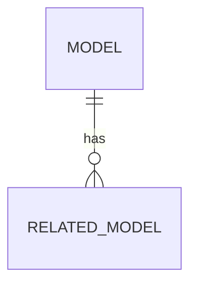

# 🏗️ PLAN: {Feature Name}

## 🗄️ Database Schema

- Migration: `202X_XX_XX_create_{table}_table.php`

## 🔌 API Contracts
### POST /api/v1/{endpoint}
**Request:**
```json
{
  "name": "required|string|max:255",
  "email": "required|email|unique:table,email"
}
```
**Validation:** `Create{Feature}Request` (FormRequest class)

**Response (201 Created):**
```json
{
  "data": {
    "id": 1,
    "name": "Example",
    "created_at": "2026-04-30T12:00:00Z"
  },
  "message": "Resource created successfully"
}
```

### GET /api/v1/{endpoint}
**Response (200 OK):**
```json
{
  "data": [...],
  "links": { "first": "...", "next": "..." },
  "meta": { "current_page": 1, "total": 100 }
}
```

## 🏗️ Service Boundaries (2-of-4 Rule)
Service required if **2+** of the following conditions met:
| Condition | Yes/No | Reason |
|-----------|--------|--------|
| 3+ models involved | | |
| External API integration | | |
| Multi-step DB transactions | | |
| Reusable across 2+ controllers | | |

**Decision:** Service = `{Yes/No}` (Reason: 2-of-4)

## 🛡️ Security Check
- Authorization: `{Gate::allows('update', $resource)}`
- Validation: `Create{Feature}Request` (FormRequest)
- Rate limiting: `{throttle:5,1}` (optional)

## 🏗️ Architecture Decisions
- Service: `Yes/No` (Reason: 2-of-4 rule)
- Patterns: `{e.g., Strategy, Factory}`
- Repository: `No` (simple CRUD)

## 📝 Notes
- No Repository Pattern for simple CRUD (per constitution)
- Thin Controllers — logic in Service or Model
- Migration `down()` must be safe